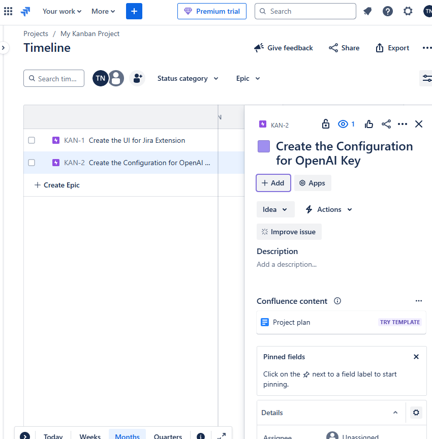

# JIRA Effective - Chrome Extension

A powerful Chrome extension that helps you create better JIRA tickets using AI assistance.

## Features

### 🤖 AI-Powered Description Generation
- Automatically generates well-structured JIRA ticket descriptions
- Provides context-aware suggestions
- Helps maintain consistent documentation standards

### ⚡ Quick Actions
- Generate descriptions with a single click
- Smart templates for different ticket types
- Customizable shortcuts for common actions

## Installation

1. Clone this repository
2. Install dependencies
```bash
yarn
```
3. Build the extension
```bash
yarn dev:chrome
```
4. Load the extension in Chrome
- Open Chrome and navigate to `chrome://extensions/`
- Enable "Developer mode"
- Click "Load unpacked"
- Select the `dist` folder from the project

## Usage

### Generating JIRA Descriptions

1. Open a JIRA ticket to this same state



2. Click the JIRA Effective extension icon


3. Select "Generate Description"
4. Review and edit the AI-generated description

## Best Practices

### Writing Effective Descriptions
- Include clear acceptance criteria
- Add relevant technical details
- Link related tickets or documentation
- Use proper formatting for readability

### Screenshot Guidelines
- Capture only relevant information
- Highlight important areas
- Remove sensitive information
- Add clear annotations when necessary

## Development

### Project Structure
```
src/
├── pages/          # Extension pages (popup, options)
├── services/       # Core services (AI, screenshots)
├── config/         # Configuration files
└── contentScript/  # Content scripts for JIRA integration
```

### Building and Testing
```bash
# Development build with hot reload
yarn dev

# Production build
yarn build
```

## Contributing

1. Fork the repository
2. Create a feature branch
3. Commit your changes
4. Push to the branch
5. Create a Pull Request

## License

This project is licensed under the MIT License - see the [LICENSE](LICENSE) file for details.

## Acknowledgments

- Based on [vite-web-extension](https://github.com/JohnBra/vite-web-extension)
- Powered by OpenAI's API